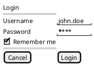

# PlantUML salt Wireframe 語彙參考

本檔為 diagram-designer skill 的 reference，僅在使用 PlantUML salt 畫 wireframe / UI mockup 時載入。salt 是 PlantUML 內建的介面草圖語法，`@startsalt`…`@endsalt` 包住即可，渲染沿用既有的 `plantuml` diagram type，交由 `render.sh plantuml` 承載，不需額外基礎設施。

## Widget 記法

| 語法 | 代表元件 |
| --- | --- |
| `[button]` | 按鈕 |
| `()` | radio button，未選中 |
| `(X)` | radio button，選中 |
| `[]` | checkbox，未勾選 |
| `[X]` | checkbox，已勾選 |
| `"text input"` | 文字輸入框（雙引號內為 placeholder 或既有值） |
| `^dropdown^` | 下拉選單 |
| `.` | 空白格，用於 grid 佈局中的留白對齊 |

## Grid / Table 佈局

以 `{ ... }` 包住整個 grid，欄位用 `|` 分隔，換行代表換列：

```text
{
  項目一 | 項目二
  項目三 | 項目四
}
```

`{#` 開頭表示帶格線的 grid（例如 `{# ... }`），視覺上會畫出表格框線；不加 `#` 則為無格線的自由對齊佈局。

## Tree

`{T ... }` 包住樹狀結構，用 `+` 的縮排層數表示階層深度：

```text
{T
 + 根節點
 ++ 子節點一
 ++ 子節點二
 +++ 孫節點
}
```

## Tabs

`{/ 分頁A | 分頁B | 分頁C }` 表示分頁列，`|` 分隔各分頁標籤。

## Menu

`{* File | Edit | View }` 表示選單列，`*` 開頭、`|` 分隔各選單項目。

## 分隔線

- `==` 表示水平分隔線
- `..` 表示虛線分隔線

## Canonical 範例：登入表單

以下範例涵蓋標題、文字輸入、密碼欄、checkbox、button，可直接複製後依需求改寫欄位名稱：


