# herdr-agent-team

- [前言](#前言)
- 前半段：給 skill 使用者
  - [1. 角色與關係](#1-角色與關係)
  - [2. 設計核心：收斂閥](#2-設計核心收斂閥)
  - [3. 整體工作流程](#3-整體工作流程)
  - [4. 用 thin command 把 skill 包裝成不同用途](#4-用-thin-command-把-skill-包裝成不同用途)
  - [5. 已知限制與信任邊界](#5-已知限制與信任邊界)
- 後半段：給維護者
  - [6. 啟動一個 worker：八步與 ACK 對帳](#6-啟動一個-worker八步與-ack-對帳)
  - [7. 六個 token 收到之後怎麼處置](#7-六個-token-收到之後怎麼處置)
  - [8. worker 的 stage 狀態機](#8-worker-的-stage-狀態機)
  - [9. 看門狗 watchdog.sh](#9-看門狗-watchdogsh)
  - [10. 漂移處置](#10-漂移處置)
  - [11. 中斷恢復](#11-中斷恢復)
  - [12. registry 結構與速查](#12-registry-結構與速查)

## 前言

`herdr-agent-team` 讓當前對話的 AI agent 擔任 orchestrator，在 herdr（一個給 coding agent 用的終端多工器）之上，指揮一群跨平台的 AI CLI worker（claude、codex、agy、opencode 四家）。人類只跟 orchestrator 對話，worker 的啟動、指派、回報與關閉都由 orchestrator 透過本 skill 的腳本完成。

前置條件：環境變數 `HERDR_ENV` 的值必須恰為 `1`，否則所有腳本一律以結束碼 `3` 結束。

本文件分兩層，讀者可以跳讀：

- **前半段（第 1 到 5 節）寫給 skill 使用者**：這個 skill 做什麼、為什麼這樣設計、一次完整的流程長什麼樣、怎麼用 thin command 定義自己的 team、哪些地方不能過度信任。
- **後半段（第 6 到 12 節）寫給維護者**：啟動序列、token 處置、stage 狀態機、看門狗、漂移處置、中斷恢復、registry 結構與腳本速查。

每一節以一張 Mermaid 圖為核心，圖後只配簡短說明。所有敘述取自 `SKILL.md`、`references/` 與 `scripts/` 的原始內容；確切的旗標、預設值與門檻，仍以各腳本檔頭註解為準。

## 1. 角色與關係

這張圖表達誰跟誰說話：人類只面對 orchestrator；orchestrator 只透過 skill 腳本作用於 worker；worker 用 `report.sh` 上行；`watchdog.sh` 在背景照看 worker 並在需要時升級給 orchestrator；調查者替 orchestrator 去讀它不該讀的內容；所有角色共享磁碟上的 registry。

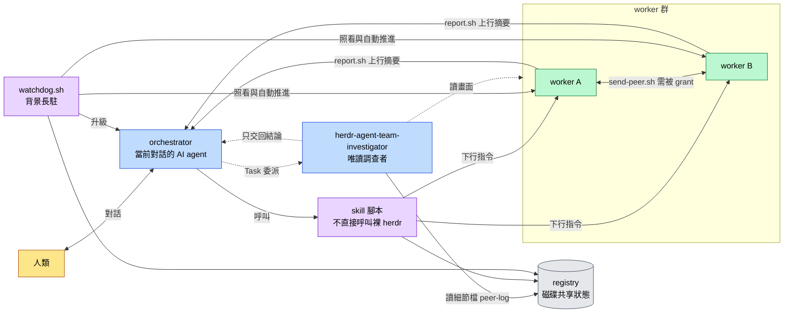
```mermaid
flowchart LR
    human["人類"]
    orch["orchestrator<br/>當前對話的 AI agent"]
    scripts["skill 腳本<br/>不直接呼叫裸 herdr"]
    inv["herdr-agent-team-investigator<br/>唯讀調查者"]
    wd["watchdog.sh<br/>背景長駐"]
    reg[("registry<br/>磁碟共享狀態")]
    subgraph team["worker 群"]
        wa["worker A"]
        wb["worker B"]
    end

    human <-->|"對話"| orch
    orch -->|"呼叫"| scripts
    scripts -->|"下行指令"| wa
    scripts -->|"下行指令"| wb
    wa -->|"report.sh 上行摘要"| orch
    wb -->|"report.sh 上行摘要"| orch
    wa <-->|"send-peer.sh 需被 grant"| wb
    wd -->|"照看與自動推進"| wa
    wd -->|"照看與自動推進"| wb
    wd -->|"升級"| orch
    orch -.->|"Task 委派"| inv
    inv -.->|"只交回結論"| orch
    inv -->|"讀細節檔 peer-log"| reg
    inv -.->|"讀畫面"| team
    scripts --> reg
    wd --> reg

    classDef kHuman fill:#fde68a,stroke:#b45309,color:#000
    classDef kOrch fill:#bfdbfe,stroke:#1d4ed8,color:#000
    classDef kWorker fill:#bbf7d0,stroke:#15803d,color:#000
    classDef kScript fill:#e9d5ff,stroke:#7e22ce,color:#000
    classDef kDisk fill:#e5e7eb,stroke:#4b5563,color:#000
    class human kHuman
    class orch,inv kOrch
    class wa,wb kWorker
    class scripts,wd kScript
    class reg kDisk
```

registry 內有 `team.json`、`workers`、`inbox`、`details`、`briefings`、`peer-log` 等檔案與目錄，結構見第 12 節。橫向對話預設不通：只有被 `grant-peer.sh` 授權的 worker 才能用 `send-peer.sh` 直接聯繫指定的對方。

## 2. 設計核心：收斂閥

worker 的產出沒有上限，而 orchestrator 的 context 是固定的，所以整個 skill 管的是流向 orchestrator 的資訊量。這張圖表達 `report.sh` 如何把一則回報拆成兩半：一行摘要直接送達，無界的細節留在磁碟上，由調查者讀取後只回結論。

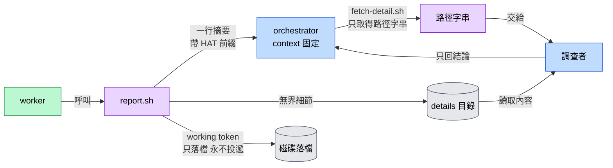
```mermaid
flowchart LR
    w["worker"] -->|"呼叫"| rs["report.sh"]
    rs -->|"一行摘要<br/>帶 HAT 前綴"| orch["orchestrator<br/>context 固定"]
    rs -->|"無界細節"| det[("details 目錄")]
    rs -->|"working token<br/>只落檔 永不投遞"| file[("磁碟落檔")]
    orch -->|"fetch-detail.sh<br/>只取得路徑字串"| path["路徑字串"]
    path -->|"交給"| inv["調查者"]
    det -->|"讀取內容"| inv
    inv -->|"只回結論"| orch

    classDef kOrch fill:#bfdbfe,stroke:#1d4ed8,color:#000
    classDef kWorker fill:#bbf7d0,stroke:#15803d,color:#000
    classDef kScript fill:#e9d5ff,stroke:#7e22ce,color:#000
    classDef kDisk fill:#e5e7eb,stroke:#4b5563,color:#000
    class w kWorker
    class rs,path kScript
    class orch,inv kOrch
    class det,file kDisk
```

送到 orchestrator 的摘要最前面帶固定前綴 `[[HAT seq=<序號> token=<token> worker=<worker>]]`，後面接 worker 原本要說的摘要。`working` 這個 token 只落檔、永不投遞，因為它的量體是其餘五個 token 加起來的百倍。

orchestrator 自己不讀畫面、不開細節檔、不讀 `peer-log`，也不使用任何 wait 動作或自寫輪詢：一阻塞就全盤停擺，連人類的訊息都進不來。

## 3. 整體工作流程

這張圖由上而下表達一個 team 從建立到收尾的順序。順序是實質的，前一步的產出是後一步的前提；goal 未確認時，`launch-worker.sh` 會以結束碼 `4` 擋下。

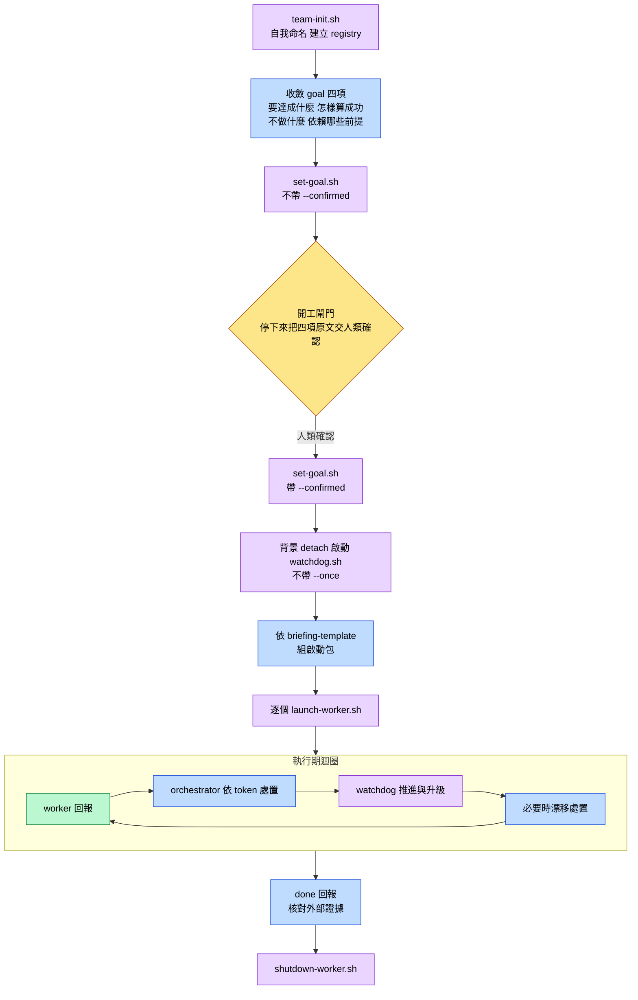
```mermaid
flowchart TD
    s1["team-init.sh<br/>自我命名 建立 registry"] --> s2["收斂 goal 四項<br/>要達成什麼 怎樣算成功<br/>不做什麼 依賴哪些前提"]
    s2 --> s3["set-goal.sh<br/>不帶 --confirmed"]
    s3 --> gate{"開工閘門<br/>停下來把四項原文交人類確認"}
    gate -->|"人類確認"| s5["set-goal.sh<br/>帶 --confirmed"]
    s5 --> s6["背景 detach 啟動 watchdog.sh<br/>不帶 --once"]
    s6 --> s7["依 briefing-template<br/>組啟動包"]
    s7 --> s8["逐個 launch-worker.sh"]
    s8 --> run
    subgraph run["執行期迴圈"]
        r1["worker 回報"] --> r2["orchestrator 依 token 處置"]
        r2 --> r3["watchdog 推進與升級"]
        r3 --> r4["必要時漂移處置"]
        r4 --> r1
    end
    run --> s9["done 回報<br/>核對外部證據"]
    s9 --> s10["shutdown-worker.sh"]

    classDef kOrch fill:#bfdbfe,stroke:#1d4ed8,color:#000
    classDef kHuman fill:#fde68a,stroke:#b45309,color:#000
    classDef kScript fill:#e9d5ff,stroke:#7e22ce,color:#000
    classDef kWorker fill:#bbf7d0,stroke:#15803d,color:#000
    class s1,s3,s5,s6,s8,s10 kScript
    class s2,s7,s9,r2,r4 kOrch
    class gate kHuman
    class r1 kWorker
    class r3 kScript
```

- goal 四項的來源有三個：thin command 的預設、觸發時的引數、對話；晚給的贏。
- 開工閘門是無條件的：不論素材看起來多明確，都要停下來交人類確認。
- `watchdog.sh` 在 goal 確認之後就掛上，不必等第一個 worker 啟動。

## 4. 用 thin command 把 skill 包裝成不同用途

thin command 是一個定義 team 編制的純文字檔：role、候選 provider、工作起點、權威來源、grant、啟動與關閉時機、完成判準，全是偏好與領域知識。它完全不提 herdr、腳本、狀態偵測、訊息格式或 token。沒有解析腳本，由 orchestrator 直接讀；沒有 thin command 時，orchestrator 會在對話中問出同一組欄位。

下圖表達 thin command 的每個欄位最後流向哪裡。

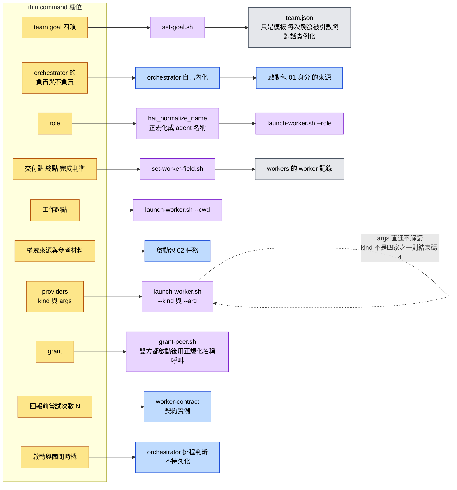
```mermaid
flowchart LR
    subgraph fields["thin command 欄位"]
        f1["team goal 四項"]
        f2["orchestrator 的<br/>負責與不負責"]
        f3["role"]
        f4["providers<br/>kind 與 args"]
        f5["工作起點"]
        f6["權威來源與參考材料"]
        f7["交付點 終點 完成判準"]
        f8["grant"]
        f9["回報前嘗試次數 N"]
        f10["啟動與關閉時機"]
    end
    f1 --> d1["set-goal.sh"] --> d1b["team.json<br/>只是模板 每次觸發被引數與對話實例化"]
    f2 --> d2["orchestrator 自己內化"]
    d2 --> d2b["啟動包 01 身分 的來源"]
    f3 --> d3["hat_normalize_name<br/>正規化成 agent 名稱"] --> d3b["launch-worker.sh --role"]
    f4 --> d4["launch-worker.sh<br/>--kind 與 --arg"]
    d4 -.->|"args 直通不解讀<br/>kind 不是四家之一則結束碼 4"| d4
    f5 --> d5["launch-worker.sh --cwd"]
    f6 --> d6["啟動包 02 任務"]
    f7 --> d7["set-worker-field.sh"] --> d7b["workers 的 worker 記錄"]
    f8 --> d8["grant-peer.sh<br/>雙方都啟動後用正規化名稱呼叫"]
    f9 --> d9["worker-contract<br/>契約實例"]
    f10 --> d10["orchestrator 排程判斷<br/>不持久化"]

    classDef kOrch fill:#bfdbfe,stroke:#1d4ed8,color:#000
    classDef kScript fill:#e9d5ff,stroke:#7e22ce,color:#000
    classDef kDisk fill:#e5e7eb,stroke:#4b5563,color:#000
    classDef kHuman fill:#fde68a,stroke:#b45309,color:#000
    class f1,f2,f3,f4,f5,f6,f7,f8,f9,f10 kHuman
    class d1,d3,d3b,d4,d5,d7,d8 kScript
    class d2,d2b,d6,d9,d10 kOrch
    class d1b,d7b kDisk
```

**完成判準必須是外部查得到的形式**（檔案存在、PR 已合併、測試通過）。寫不出來代表這個 role 無法被安全關閉：orchestrator 看不到開發內容，「完成」不能靠 worker 自我宣告，得先改設計讓產物落到查得到的地方。

以下三個範例的 provider 參數只使用 `references/` 中出現過的寫法。

### 範例一 fullstack-feature

用途：前端與後端兩個 worker 平行開發同一個功能，雙方被 grant 直接協商 API 介面。

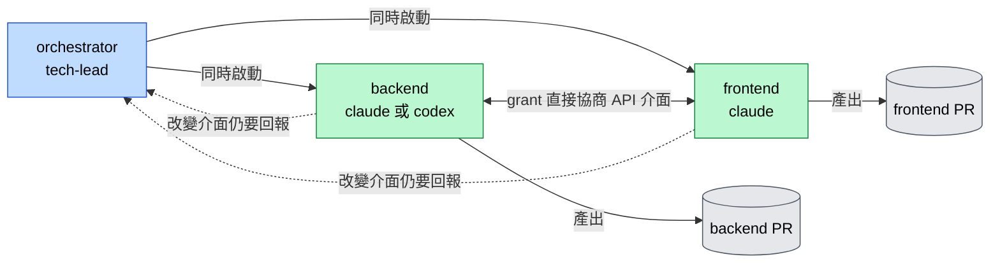
```mermaid
flowchart LR
    orch["orchestrator<br/>tech-lead"]
    be["backend<br/>claude 或 codex"]
    fe["frontend<br/>claude"]
    prb[("backend PR")]
    prf[("frontend PR")]

    orch -->|"同時啟動"| be
    orch -->|"同時啟動"| fe
    be <-->|"grant 直接協商 API 介面"| fe
    be -->|"產出"| prb
    fe -->|"產出"| prf
    be -.->|"改變介面仍要回報"| orch
    fe -.->|"改變介面仍要回報"| orch

    classDef kOrch fill:#bfdbfe,stroke:#1d4ed8,color:#000
    classDef kWorker fill:#bbf7d0,stroke:#15803d,color:#000
    classDef kDisk fill:#e5e7eb,stroke:#4b5563,color:#000
    class orch kOrch
    class be,fe kWorker
    class prb,prf kDisk
```

```text
---
name: fullstack-feature
description: 前端與後端平行開發同一個功能
---

# team goal（預設，觸發時可用引數或對話覆寫）
要達成: 完成 issue 123 描述的功能，前後端都上線可用
怎樣算成功: backend 與 frontend 各自的 PR 都已合併，且合併前 CI 全部通過
不做: 資料庫 schema 以外的重構、與此功能無關的 UI 調整
前提: API 介面由 backend 與 frontend 協商定案，不另外等設計稿

# orchestrator
role: tech-lead
負責: 裁決前後端之間協商不出來的衝突、確認介面變更是否影響其他人
不負責: 自己寫任何一行功能程式碼、讀 worker 的 PR diff

# workers

role: backend
  providers:
    - kind: claude
      args: ["--permission-mode", "auto", "--model", "opus"]
    - kind: codex
      args: ["-s", "workspace-write", "-m", "gpt-5.6-terra"]
  工作起點: backend/
  權威來源: github://issue/123
  參考材料: docs/api/*.md
  交付點: backend PR 開出
  終點: backend PR 合併
  完成判準: github://issue/123 對應的 backend PR 狀態為已合併，且該 PR 的 CI 全部通過

role: frontend
  providers:
    - kind: claude
      args: ["--permission-mode", "auto", "--model", "sonnet"]
  工作起點: frontend/
  權威來源: github://issue/123
  交付點: frontend PR 開出
  終點: frontend PR 合併
  完成判準: github://issue/123 對應的 frontend PR 狀態為已合併，且該 PR 的 CI 全部通過

# 啟動時機
- goal 確認後，同時啟動 backend 與 frontend

# 關閉時機
- 交付點（PR 開出）到了不關，review 回來可能要改
- PR 合併、完成判準成立後，各自關閉

# grant
- backend ↔ frontend  # API 介面要雙方直接協商，orchestrator 答不了

# 回報前的嘗試次數
N: 3
```

**這個範例示範了什麼：**

- grant 的用途：讓雙方跳過 orchestrator 直接協商介面；但談定的結果若改變了雙方之間的介面，契約仍要求回報 orchestrator。
- 完成判準外部化：以 PR 已合併與 CI 通過這種外部查得到的事實，取代「worker 說做完了」。
- delivered 不等於終點：PR 開出是交付點，review 回來可能要改，所以交付點到了不關閉，要等 PR 合併。

### 範例二 bugfix-pair

用途：reproducer 先寫出能重現 bug 的失敗測試並 commit，fixer 再讓那個測試通過。兩個角色依序啟動，不設 grant。

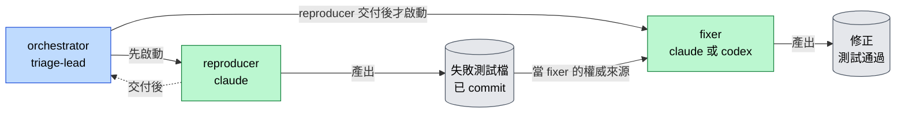
```mermaid
flowchart LR
    orch["orchestrator<br/>triage-lead"]
    rep["reproducer<br/>claude"]
    test[("失敗測試檔<br/>已 commit")]
    fix["fixer<br/>claude 或 codex"]
    patch[("修正<br/>測試通過")]

    orch -->|"先啟動"| rep
    rep -->|"產出"| test
    rep -.->|"交付後"| orch
    orch -->|"reproducer 交付後才啟動"| fix
    test -->|"當 fixer 的權威來源"| fix
    fix -->|"產出"| patch

    classDef kOrch fill:#bfdbfe,stroke:#1d4ed8,color:#000
    classDef kWorker fill:#bbf7d0,stroke:#15803d,color:#000
    classDef kDisk fill:#e5e7eb,stroke:#4b5563,color:#000
    class orch kOrch
    class rep,fix kWorker
    class test,patch kDisk
```

```text
---
name: bugfix-pair
description: 先寫出重現 bug 的失敗測試，再修到測試通過
---

# team goal（預設，觸發時可用引數或對話覆寫）
要達成: 修好 issue 456 描述的 bug
怎樣算成功: tests/regression/issue-456.test.ts 通過，且既有測試全部通過
不做: 順便重構相鄰程式碼、修其他 issue 的 bug
前提: issue 456 的重現步驟是正確的

# orchestrator
role: triage-lead
負責: 判斷 reproducer 的測試是否真的重現了 issue 描述的問題、裁決兩個角色之間的分歧
不負責: 自己寫測試或修正、讀 worker 的程式碼 diff

# workers

role: reproducer
  providers:
    - kind: claude
      args: ["--permission-mode", "auto", "--model", "sonnet"]
  工作起點: .
  權威來源: github://issue/456
  交付點: 失敗測試已 commit
  終點: 失敗測試被 fixer 採用
  完成判準: tests/regression/issue-456.test.ts 存在，且在目前 main 上執行結果為失敗

role: fixer
  providers:
    - kind: claude
      args: ["--permission-mode", "auto", "--model", "opus"]
    - kind: codex
      args: ["-s", "workspace-write", "-m", "gpt-5.6-terra"]
  工作起點: .
  權威來源: file://tests/regression/issue-456.test.ts   # reproducer 的產物
  參考材料: github://issue/456
  交付點: 修正已 push
  終點: 修正合併
  完成判準: tests/regression/issue-456.test.ts 通過，且既有測試全部通過

# 啟動時機
- 先啟動 reproducer
- reproducer 交付後才啟動 fixer

# 關閉時機
- reproducer 的完成判準成立後關閉
- fixer 的完成判準成立後關閉

# grant
- 不設 grant  # 兩者之間只靠已 commit 的測試檔交接；測試若有疑義，fixer 照契約回報 orchestrator

# 回報前的嘗試次數
fixer: 5   # 修 bug 常需要多試幾種做法才回報
# reproducer 不指定，沿用預設 3
```

**這個範例示範了什麼：**

- 依序啟動：fixer 要等 reproducer 交付才啟動，因為 fixer 的權威來源是 reproducer 的產物。
- 前一個角色的產物當下一個角色的權威來源：fixer 以測試檔為準，不靠對話轉述。
- N 是可依 role 調整的旋鈕：fixer 設為 5，reproducer 沿用預設 3。本例把 N 依 role 分行列在最後一段；`references/thin-command-format.md` 的範例只有單一 `N`，兩種寫法取得的是同一個欄位。
- 為什麼不設 grant：fixer 啟動時 reproducer 已交付並靜止，交接靠的是已 commit 的檔案；fixer 若認為測試有誤，屬於「照權威來源做會失敗」的落差，契約要求回報 orchestrator，而不是私下協商。

### 範例三 tech-survey

用途：三位研究員平行調查同一個技術選型問題，各自產出一份報告檔，由 orchestrator 整合成比較結論。不設 grant，刻意讓研究員彼此不知道對方，以保持結論獨立。

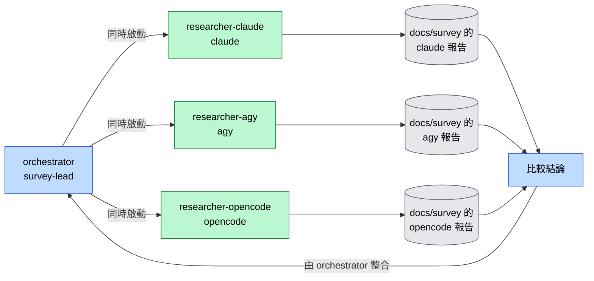
```mermaid
flowchart LR
    orch["orchestrator<br/>survey-lead"]
    r1["researcher-claude<br/>claude"]
    r2["researcher-agy<br/>agy"]
    r3["researcher-opencode<br/>opencode"]
    d1[("docs/survey 的<br/>claude 報告")]
    d2[("docs/survey 的<br/>agy 報告")]
    d3[("docs/survey 的<br/>opencode 報告")]
    cmp["比較結論"]

    orch -->|"同時啟動"| r1
    orch -->|"同時啟動"| r2
    orch -->|"同時啟動"| r3
    r1 --> d1
    r2 --> d2
    r3 --> d3
    d1 --> cmp
    d2 --> cmp
    d3 --> cmp
    cmp -->|"由 orchestrator 整合"| orch

    classDef kOrch fill:#bfdbfe,stroke:#1d4ed8,color:#000
    classDef kWorker fill:#bbf7d0,stroke:#15803d,color:#000
    classDef kDisk fill:#e5e7eb,stroke:#4b5563,color:#000
    class orch,cmp kOrch
    class r1,r2,r3 kWorker
    class d1,d2,d3 kDisk
```

```text
---
name: tech-survey
description: 三位研究員平行調查同一個技術選型，產出各自的報告
---

# team goal（預設，觸發時可用引數或對話覆寫）
要達成: 針對 issue 789 的技術選型問題，產出一份比較結論
怎樣算成功: docs/survey/ 下有三份獨立報告，且 docs/survey/comparison.md 引用到這三份
不做: 實作任何一個候選方案、做最終採購決定
前提: 候選方案清單已在 issue 789 列定

# orchestrator
role: survey-lead
負責: 把三份獨立報告整合成比較結論、指出三份結論之間的差異
不負責: 自己做技術調查、在研究員之間傳話

# workers

role: researcher-claude
  providers:
    - kind: claude
      args: ["--permission-mode", "auto", "--model", "sonnet"]
  工作起點: .
  權威來源: github://issue/789
  交付點: 報告初稿寫出
  終點: 比較結論定稿
  完成判準: docs/survey/claude.md 存在且含「評估準則」「各方案優缺點」「建議」三個小節

role: researcher-agy
  providers:
    - kind: agy
      args: ["--model", "flash", "--dangerously-skip-permissions"]   # 低保真 kind；旗標原因見 provider-drivers.md「agy alias 陷阱」
  工作起點: .
  權威來源: github://issue/789
  交付點: 報告初稿寫出
  終點: 比較結論定稿
  完成判準: docs/survey/agy.md 存在且含「評估準則」「各方案優缺點」「建議」三個小節

role: researcher-opencode
  providers:
    - kind: opencode
      args: ["--auto"]   # 低保真 kind
  工作起點: .
  權威來源: github://issue/789
  交付點: 報告初稿寫出
  終點: 比較結論定稿
  完成判準: docs/survey/opencode.md 存在且含「評估準則」「各方案優缺點」「建議」三個小節

# 啟動時機
- goal 確認後，同時啟動三位研究員

# 關閉時機
- 交付點到了不關，整合時可能要求補充
- 比較結論定稿後，逐一關閉

# grant
- 不設 grant  # 刻意讓研究員彼此不知道對方，保持結論獨立

# 回報前的嘗試次數
N: 3
```

**這個範例示範了什麼：**

- 無 grant 的契約：同儕段落整段換成「你聯絡不到其他 worker，也不需要。有問題就回報 orchestrator。」
- 低保真 provider 的代價：`agy` 與 `opencode` 的 `idle` 沒有正向證據。啟動這兩家時，orchestrator 會在事件流中明確告知使用者：失去「違約沒回報就停下」與「原地繞圈」兩種偵測，只能靠停滯偵測（`AGENT_TEAM_STALL_SECONDS`，預設 1800 秒）接住；而這道偵測只涵蓋 stage 為 `running` 的 worker。
- agy alias 陷阱：互動 shell 裡的 `agy` 是一個帶 `--dangerously-skip-permissions` 的 alias，但 `herdr agent start` 不經過互動 shell，直接執行真實二進位，alias 不會生效。不顯式帶這個旗標，agy worker 會停在啟動後第一個權限框，而且在 herdr 眼中只是「閒置」，沒有任何錯誤訊息。

這三份是說明用範例，未經實際執行驗證，不是 skill 內附檔案。`references/thin-command-format.md` 內另有一份 `prd-team` 範例。

## 5. 已知限制與信任邊界

這張圖表達三個沒有（或只有部分）機制撐著的地方，各自「擋得住什麼」與「擋不住什麼」。

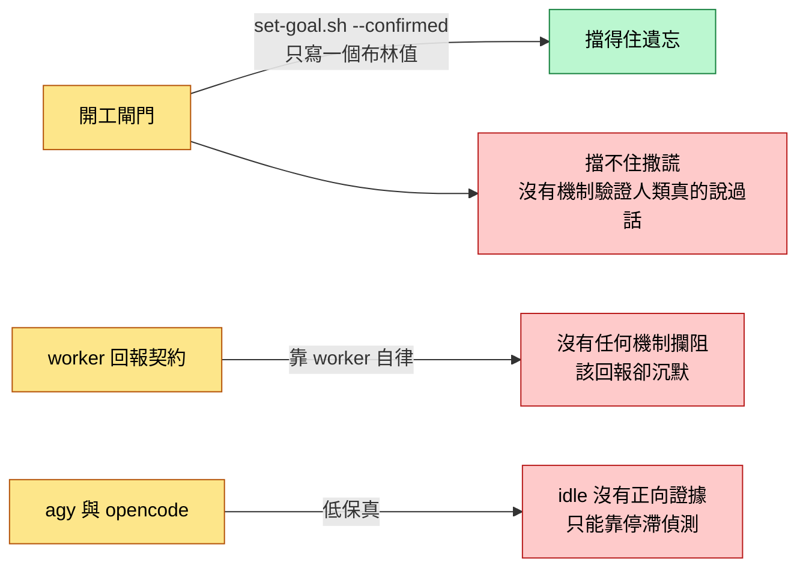
```mermaid
flowchart LR
    a1["開工閘門"] -->|"set-goal.sh --confirmed<br/>只寫一個布林值"| a2["擋得住遺忘"]
    a1 --> a3["擋不住撒謊<br/>沒有機制驗證人類真的說過話"]
    b1["worker 回報契約"] -->|"靠 worker 自律"| b2["沒有任何機制攔阻<br/>該回報卻沉默"]
    c1["agy 與 opencode"] -->|"低保真"| c2["idle 沒有正向證據<br/>只能靠停滯偵測"]

    classDef kOk fill:#bbf7d0,stroke:#15803d,color:#000
    classDef kWarn fill:#fecaca,stroke:#b91c1c,color:#000
    classDef kGate fill:#fde68a,stroke:#b45309,color:#000
    class a2 kOk
    class a3,b2,c2 kWarn
    class a1,b1,c1 kGate
```

- **開工閘門只擋得住遺忘，擋不住撒謊**：記下「人類確認過了」的是 orchestrator 自己，`set-goal.sh --confirmed` 只是把一個布林值寫進 `team.json`。
- **worker 的回報契約是整份設計裡唯一完全沒有機制撐著的東西**：該不該回報完全靠 worker 自律。因此契約的每一條判準都寫成可觀察的是非題、不出現「重大」這類主觀詞；回報前的嘗試次數 N 是具體數字；「事後」那一條明寫不究責。
- **agy 與 opencode 低保真**：它們沒有正向 idle 規則，「idle」只是「沒有任何規則命中」，不是 worker 確實停下的證明。

## 6. 啟動一個 worker：八步與 ACK 對帳

這張圖表達 `launch-worker.sh` 的八步序列（順序不得調換），以及第 4、5、7 步失敗時的重試處置。

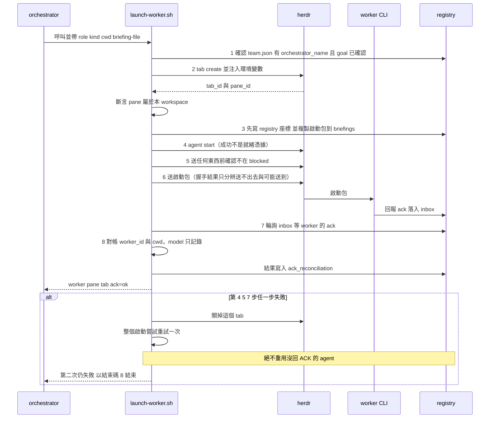
```mermaid
sequenceDiagram
    participant O as orchestrator
    participant L as launch-worker.sh
    participant H as herdr
    participant C as worker CLI
    participant R as registry

    O->>L: 呼叫並帶 role kind cwd briefing-file
    L->>R: 1 確認 team.json 有 orchestrator_name 且 goal 已確認
    L->>H: 2 tab create 並注入環境變數
    H-->>L: tab_id 與 pane_id
    L->>L: 斷言 pane 屬於本 workspace
    L->>R: 3 先寫 registry 座標 並複製啟動包到 briefings
    L->>H: 4 agent start（成功不是就緒憑據）
    L->>H: 5 送任何東西前確認不在 blocked
    L->>H: 6 送啟動包（握手結果只分辨送不出去與可能送到）
    H->>C: 啟動包
    C->>R: 回報 ack 落入 inbox
    L->>R: 7 輪詢 inbox 等 worker 的 ack
    L->>L: 8 對帳 worker_id 與 cwd，model 只記錄
    L->>R: 結果寫入 ack_reconciliation
    L-->>O: worker pane tab ack=ok
    alt 第 4 5 7 步任一步失敗
        L->>H: 關掉這個 tab
        L->>L: 整個啟動嘗試重試一次
        Note over L,R: 絕不重用沒回 ACK 的 agent
        L-->>O: 第二次仍失敗 以結束碼 8 結束
    end
```

為什麼這樣設計：實測 `agent start` 回報成功時 CLI 介面還沒起來，握手成功也不代表送達（codex 的版本更新框會吃掉 Enter，握手仍回報成功）。唯一可信的就緒訊號是 worker 自己回的第一則 ack，格式固定為 `worker_id=<id> cwd=<絕對路徑> model=<名稱>`。對帳時，`worker_id` 與 `cwd` 以啟動時指定的值為準比對，`model` 因為原生引數直通不解讀，只記錄 worker 回報的值。

第 3 步先寫座標、複製啟動包，是為了「關得掉才重得來」：`briefings/<worker>.md` 是中斷恢復之後唯一能重建當初派了什麼的副本。

codex 的 `startup_update` 啟動框是啟動框允許清單上唯一一筆，對應按鍵 `2`（Skip）；清單外的框一律升級給人，不代按。

## 7. 六個 token 收到之後怎麼處置

這張圖表達 orchestrator 收到一則訊息後的分岔：先判斷是不是看門狗升級，不是才依 token 處置。

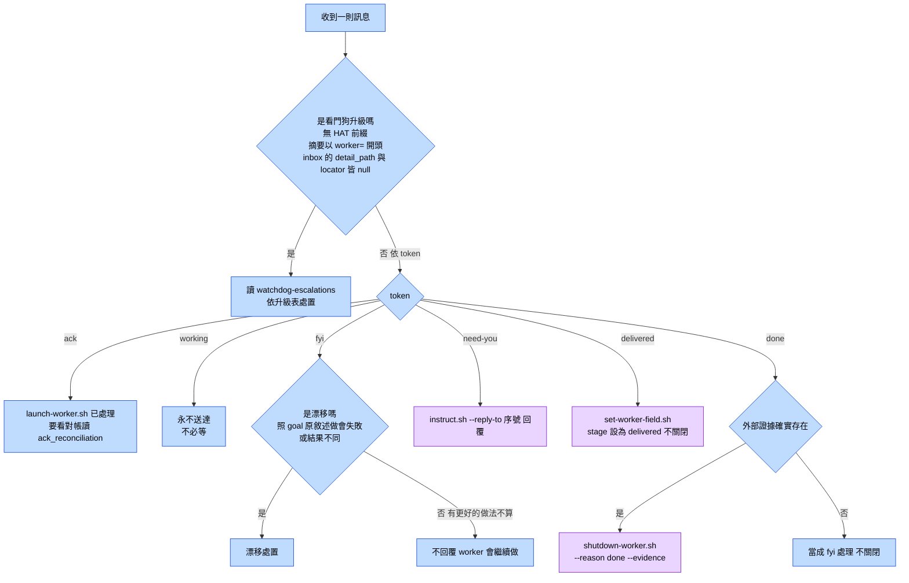
```mermaid
flowchart TD
    start["收到一則訊息"] --> q{"是看門狗升級嗎<br/>無 HAT 前綴<br/>摘要以 worker= 開頭<br/>inbox 的 detail_path 與 locator 皆 null"}
    q -->|"是"| esc["讀 watchdog-escalations<br/>依升級表處置"]
    q -->|"否 依 token"| t{"token"}
    t -->|"ack"| ack["launch-worker.sh 已處理<br/>要看對帳讀 ack_reconciliation"]
    t -->|"working"| wk["永不送達<br/>不必等"]
    t -->|"fyi"| dq{"是漂移嗎<br/>照 goal 原敘述做會失敗<br/>或結果不同"}
    dq -->|"是"| dr["漂移處置"]
    dq -->|"否 有更好的做法不算"| nr["不回覆 worker 會繼續做"]
    t -->|"need-you"| ny["instruct.sh --reply-to 序號 回覆"]
    t -->|"delivered"| dl["set-worker-field.sh<br/>stage 設為 delivered 不關閉"]
    t -->|"done"| dn{"外部證據確實存在"}
    dn -->|"是"| sd["shutdown-worker.sh<br/>--reason done --evidence"]
    dn -->|"否"| fy["當成 fyi 處理 不關閉"]

    classDef kOrch fill:#bfdbfe,stroke:#1d4ed8,color:#000
    classDef kScript fill:#e9d5ff,stroke:#7e22ce,color:#000
    classDef kWarn fill:#fecaca,stroke:#b91c1c,color:#000
    class start,q,t,dq,dn,esc,dr,nr,fy,ack,wk kOrch
    class ny,dl,sd kScript
```

認錯升級的代價不對稱：把升級讀成 worker 的 `fyi`，會走到「不必回覆，worker 會繼續做」，而升級講的那個 worker 正好不會繼續做。

- `done` 關閉前 stage 不能是 `delivered`，否則 `shutdown-worker.sh` 以結束碼 `4` 拒絕，要先撥回 `running`（見第 8 節）。
- `fyi` 若是看門狗升級，不套漂移判準，依五種升級條件處置（見第 9.4 節的對照表）。

## 8. worker 的 stage 狀態機

這張圖表達 worker 記錄的 `.stage` 欄位如何在四個關卡之間移動。

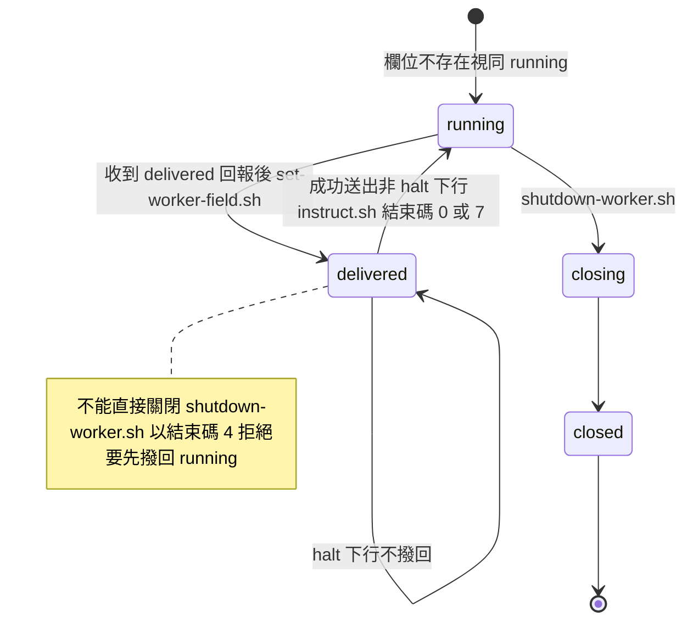
```mermaid
stateDiagram-v2
    [*] --> running : 欄位不存在視同 running
    running --> delivered : 收到 delivered 回報後 set-worker-field.sh
    delivered --> running : 成功送出非 halt 下行 instruct.sh 結束碼 0 或 7
    delivered --> delivered : halt 下行不撥回
    running --> closing : shutdown-worker.sh
    closing --> closed
    closed --> [*]
    note right of delivered
        不能直接關閉 shutdown-worker.sh 以結束碼 4 拒絕
        要先撥回 running
    end note
```

`delivered`、`closing`、`closed` 不在看門狗自動推進、停滯偵測與達上限升級的範圍；但 blocked、豁免到期、身分消失三種升級不受影響，照常發出。`closing` 與 `closed` 收到下行時不動。

## 9. 看門狗 watchdog.sh

### 9.1 為什麼需要看門狗

根本矛盾：orchestrator 被禁止主動等待（任何 wait 或輪詢一阻塞，連人類訊息都進不來），而 worker 又是會停下來的 CLI。所以需要一個外部、長駐、不佔 orchestrator context 的事件來源。

下圖由左到右對照七個問題、沒人處理的後果，以及看門狗的對應職責。

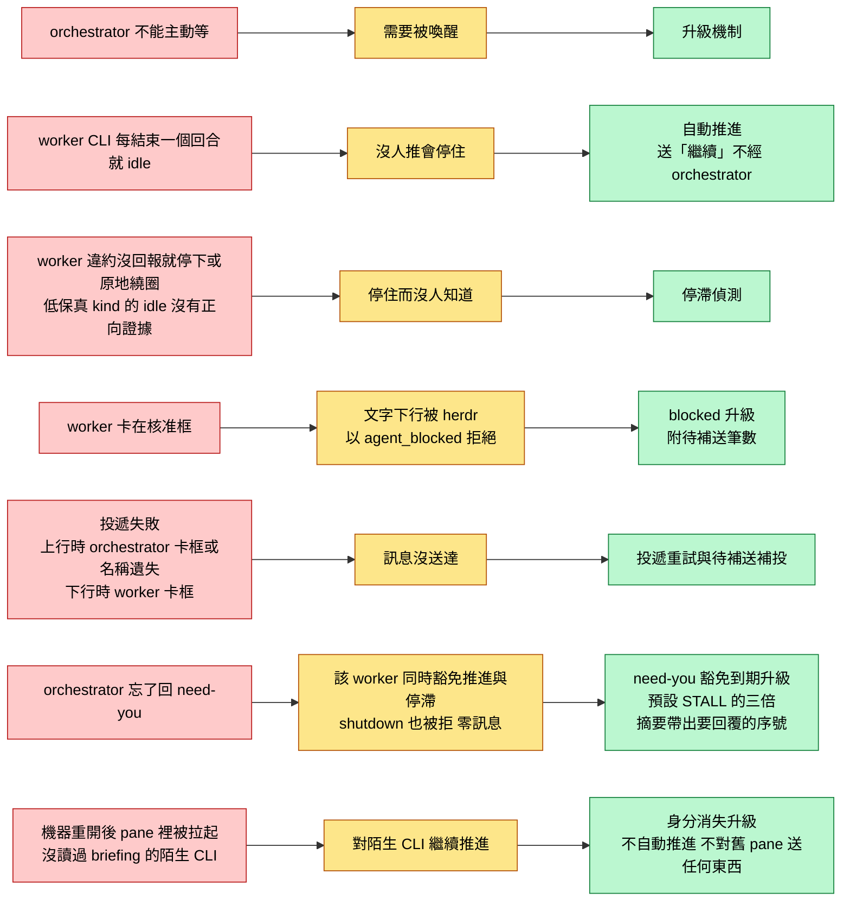
```mermaid
flowchart LR
    p1["orchestrator 不能主動等"] --> c1["需要被喚醒"] --> r1["升級機制"]
    p2["worker CLI 每結束一個回合就 idle"] --> c2["沒人推會停住"] --> r2["自動推進<br/>送「繼續」不經 orchestrator"]
    p3["worker 違約沒回報就停下或原地繞圈<br/>低保真 kind 的 idle 沒有正向證據"] --> c3["停住而沒人知道"] --> r3["停滯偵測"]
    p4["worker 卡在核准框"] --> c4["文字下行被 herdr<br/>以 agent_blocked 拒絕"] --> r4["blocked 升級<br/>附待補送筆數"]
    p5["投遞失敗<br/>上行時 orchestrator 卡框或名稱遺失<br/>下行時 worker 卡框"] --> c5["訊息沒送達"] --> r5["投遞重試與待補送補投"]
    p6["orchestrator 忘了回 need-you"] --> c6["該 worker 同時豁免推進與停滯<br/>shutdown 也被拒 零訊息"] --> r6["need-you 豁免到期升級<br/>預設 STALL 的三倍<br/>摘要帶出要回覆的序號"]
    p7["機器重開後 pane 裡被拉起<br/>沒讀過 briefing 的陌生 CLI"] --> c7["對陌生 CLI 繼續推進"] --> r7["身分消失升級<br/>不自動推進 不對舊 pane 送任何東西"]

    classDef kProblem fill:#fecaca,stroke:#b91c1c,color:#000
    classDef kEffect fill:#fde68a,stroke:#b45309,color:#000
    classDef kDuty fill:#bbf7d0,stroke:#15803d,color:#000
    class p1,p2,p3,p4,p5,p6,p7 kProblem
    class c1,c2,c3,c4,c5,c6,c7 kEffect
    class r1,r2,r3,r4,r5,r6,r7 kDuty
```

### 9.2 自動推進

看門狗發現某個 worker 做完一回合後停下來等輸入，就直接送它一句「繼續」，讓它接著做；這個動作不經過 orchestrator，orchestrator 完全不知情。

為什麼需要：AI CLI 的天性是每做完一回合就停下來等人輸入。orchestrator 被禁止主動等待或輪詢，而且由它來推每一次都要耗掉固定的 context，所以這件事交給背景的看門狗。

下圖表達一段時間軸：worker 每次閒下來都被推一次，計數遞增，直到 worker 自己回報 done，orchestrator 只收到最後那一則。

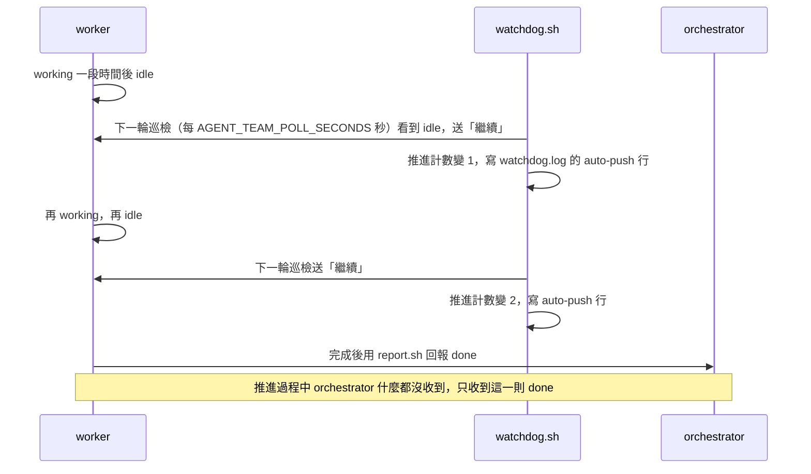
```mermaid
sequenceDiagram
    participant W as worker
    participant D as watchdog.sh
    participant O as orchestrator

    W->>W: working 一段時間後 idle
    D->>W: 下一輪巡檢（每 AGENT_TEAM_POLL_SECONDS 秒）看到 idle，送「繼續」
    D->>D: 推進計數變 1，寫 watchdog.log 的 auto-push 行
    W->>W: 再 working，再 idle
    D->>W: 下一輪巡檢送「繼續」
    D->>D: 推進計數變 2，寫 auto-push 行
    W->>O: 完成後用 report.sh 回報 done
    Note over W,O: 推進過程中 orchestrator 什麼都沒收到，只收到這一則 done
```

全部條件同時成立才推：

| 條件 | 不成立時為什麼不推 |
| --- | --- |
| 狀態是 idle 或 done | `working` 是在忙；`unknown` 不證明工作已停下，推了可能打斷正在做事的 worker |
| 不在 blocked | 文字下行會被 herdr 以 `agent_blocked` 拒絕，改為升級 |
| `.stage` 是 `running` | `delivered` 是交付後待命的正常靜止 |
| 沒有未回覆的 need-you | worker 在等 orchestrator 定案，停著是合理的 |
| 持有旗標 `held` 不是 true | orchestrator 正在對話，再插一句可能兩則併進同一回合，造成混合意圖 |
| 推進計數未達 `AGENT_TEAM_AUTO_PUSH_LIMIT` | 達到上限改為升級 |

推進直接呼叫 `herdr agent prompt` 送出，不走 `instruct.sh`：`instruct.sh` 會設持有旗標，走它等於每推一次都把下一輪的自己擋掉。

**上限與歸零**：上限預設 10，推滿就改發「自動推進已達上限」升級。這是用次數代替判斷：被推 10 次仍沒做完也沒回報，很可能在原地繞圈。計數只有兩種情況會歸零：

- orchestrator 成功送出一則下行（`instruct.sh`；`--kind halt` 除外，halt 不寫 `.last_delivered_at`）。
- 看門狗補投待補送的下行成功。

計數不隨時間衰減，所以達上限的升級等待解不了，出口只有改派或結束。當初「回報 delivered 就歸零」造成的 livelock，見 9.3 的守衛說明。

**對長任務的意義**：需要很多回合才做得完的任務，在 orchestrator 兩次下行之間最多只能被自動推 10 回合。有兩種做法：

- 調高 `AGENT_TEAM_AUTO_PUSH_LIMIT`。代價是繞圈的 worker 會多燒回合與 token 才被發現，agy 與 opencode 這類低保真 provider 風險更高。
- 把任務切成階段，在里程碑由 orchestrator 送一則下行交代下一階段，計數因此歸零，orchestrator 也能在階段之間核對進度。這個做法較安全。

操作注意事項：

- 門檻值只在看門狗啟動時讀一次，改值要重啟；重啟前先確認舊實例已停，因為腳本沒有防多實例機制。
- 中斷恢復重掛時要帶同一組環境變數，否則會靜默回到預設值。
- thin command 沒有欄位可以宣告這些門檻，目前只能在啟動看門狗的指令前帶環境變數。
- 單一工具呼叫跑很久時，worker 的狀態是 `working`，不受自動推進與停滯偵測影響，不需要調這些參數。

### 9.3 運作機制

這張圖表達 `watchdog.sh` 每一輪的處理順序，順序以 `hat_wd_process_worker` 的實際程式碼為準。

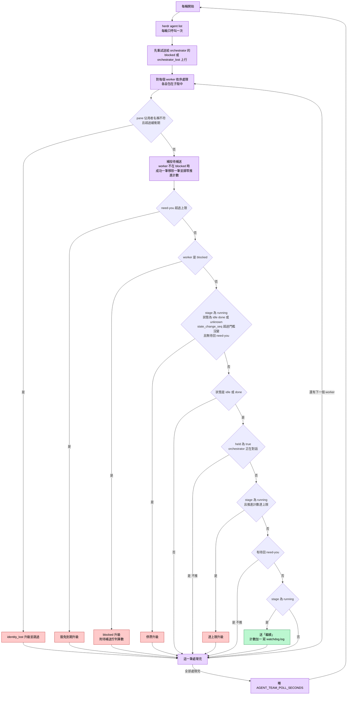
```mermaid
flowchart TD
    start["每輪開始"] --> list["herdr agent list<br/>每輪只呼叫一次"]
    list --> retryO["先重試送給 orchestrator 的<br/>blocked 或 orchestrator_lost 上行"]
    retryO --> each["對每個 worker 依序處理<br/>各自包在子殼中"]
    each --> idc{"pane 佔用者名稱不符<br/>且超過緩衝期"}
    idc -->|"是"| eid["identity_lost 升級並跳過"]
    idc -->|"否"| resend["補投待補送<br/>worker 不在 blocked 時<br/>成功一筆移除一筆並歸零推進計數"]
    resend --> ny{"need-you 超過上限"}
    ny -->|"是"| eny["豁免到期升級"]
    ny -->|"否"| bl{"worker 是 blocked"}
    bl -->|"是"| ebl["blocked 升級<br/>附待補送佇列筆數"]
    bl -->|"否"| st{"stage 為 running<br/>狀態為 idle done 或 unknown<br/>state_change_seq 超過門檻沒變<br/>且無待回 need-you"}
    st -->|"是"| est["停滯升級"]
    st -->|"否"| idl{"狀態是 idle 或 done"}
    idl -->|"否"| fin["這一筆處理完"]
    idl -->|"是"| held{"held 為 true<br/>orchestrator 正在對話"}
    held -->|"是 不推"| fin
    held -->|"否"| lim{"stage 為 running<br/>且推進計數達上限"}
    lim -->|"是"| elim["達上限升級"]
    lim -->|"否"| pend{"有待回 need-you"}
    pend -->|"是 不推"| fin
    pend -->|"否"| run{"stage 為 running"}
    run -->|"是"| push["送「繼續」<br/>計數加一 寫 watchdog.log"]
    run -->|"否"| fin
    push --> fin
    eid --> fin
    eny --> fin
    ebl --> fin
    est --> fin
    elim --> fin
    fin -->|"還有下一個 worker"| each
    fin -->|"全部處理完"| slp["睡 AGENT_TEAM_POLL_SECONDS"]
    slp --> start

    classDef kScript fill:#e9d5ff,stroke:#7e22ce,color:#000
    classDef kWarn fill:#fecaca,stroke:#b91c1c,color:#000
    classDef kOk fill:#bbf7d0,stroke:#15803d,color:#000
    class start,list,retryO,each,resend,fin,slp kScript
    class eid,eny,ebl,est,elim kWarn
    class push kOk
```

每個 worker 各自包在子殼中：一筆處理失敗只會在 `watchdog.log` 記一行 skip，不會帶走整個行程。身分檢查的緩衝期是 90 秒：第一次發現名稱不符只記下時間，超過緩衝期才升級。

下圖表達五個守衛與防呆設計各自防止的失效。

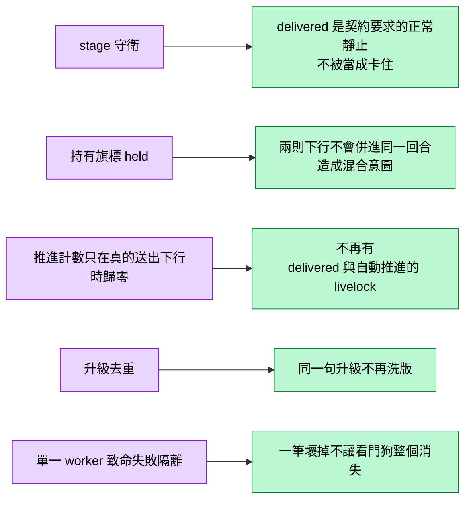
```mermaid
flowchart LR
    g1["stage 守衛"] --> e1["delivered 是契約要求的正常靜止<br/>不被當成卡住"]
    g2["持有旗標 held"] --> e2["兩則下行不會併進同一回合<br/>造成混合意圖"]
    g3["推進計數只在真的送出下行時歸零"] --> e3["不再有<br/>delivered 與自動推進的 livelock"]
    g4["升級去重"] --> e4["同一句升級不再洗版"]
    g5["單一 worker 致命失敗隔離"] --> e5["一筆壞掉不讓看門狗整個消失"]

    classDef kGuard fill:#e9d5ff,stroke:#7e22ce,color:#000
    classDef kEffect fill:#bbf7d0,stroke:#15803d,color:#000
    class g1,g2,g3,g4,g5 kGuard
    class e1,e2,e3,e4,e5 kEffect
```

- **stage 守衛**：只有 stage 為 `running` 的 worker 會被推、被判停滯、被發達上限升級。
- **持有旗標**：`instruct.sh` 送出前把 `held` 設為 true，所有離開路徑都放掉，避免兩則下行併進同一回合造成混合意圖。看門狗的自動推進不走 `instruct.sh`，以免自己擋自己。
- **推進計數只在 orchestrator 真的送出下行時歸零**：`instruct.sh` 寫 `.last_delivered_at`，看門狗比對水位線；`--kind halt` 不寫，叫停不是續杯。當初「回報 delivered 就歸零」造成了 livelock：worker 在 delivered 靜止卻被推，推滿上限只好再報 delivered，計數又歸零，同一句升級在 inbox 重複了 56 次。
- **升級去重**：同一個條件只在剛成立的那一輪發一次，之後最多每 `AGENT_TEAM_ESCALATION_REPEAT_SECONDS` 重提一次；條件解除或換成另一種條件時立即再發。
- **單一 worker 致命失敗隔離**：保護放在逐筆呼叫點的子殼，詳見 `watchdog.sh` 檔頭。

### 9.4 存活判讀與門檻

看門狗必須背景 detach 啟動、不帶 `--once`。前景呼叫逾時被工具收掉時是靜默消失：自動推進、升級、停滯偵測、重試補投全部停止，且沒有任何錯誤訊息。

- 剛掛上時 `watchdog.log` 是空的，這是正常的。
- 之後有新行代表它活著；但沒有新行不代表停了，因為升級、補投成功、停滯追蹤都不寫這個檔案。可以看 inbox 有沒有新的升級記錄，或 `team-status.sh` 的欄位有沒有變化。
- 重掛前要確認沒有仍在跑的 watchdog，腳本沒有防多實例機制。

門檻都可以用同名環境變數覆寫：

| 環境變數 | 預設值 | 影響 |
| --- | --- | --- |
| `AGENT_TEAM_POLL_SECONDS` | 20 | 每輪掃描的間隔 |
| `AGENT_TEAM_STALL_SECONDS` | 1800 | stage 為 `running` 的 worker，`state_change_seq` 多久沒變就判定停滯 |
| `AGENT_TEAM_AUTO_PUSH_LIMIT` | 10 | 對同一個 worker 自動推進「繼續」的次數上限 |
| `AGENT_TEAM_NEEDYOU_LIMIT_SECONDS` | 停滯門檻的三倍 | need-you 未回覆多久視為豁免到期 |
| `AGENT_TEAM_ESCALATION_REPEAT_SECONDS` | 同停滯門檻 | 同一個升級條件兩次升級之間的最短間隔 |
| `AGENT_TEAM_LOCK_TIMEOUT_SECONDS` | 30 | registry 檔案鎖的等待上限，逾時以結束碼 `5` 失敗；定義在 `lib/common.sh` |

這些數字都沒有實測依據，是私用階段的起點。

五種升級條件與處置（依 `references/watchdog-escalations.md`）：

| 升級條件（摘要特徵） | 處置 |
| --- | --- |
| 卡在核准框（摘要含 `agent_status=blocked` 與待補送筆數） | 派調查者讀畫面判讀；可代按的呼叫 `press-approval.sh`；工作區信任框與放行範圍大於當次動作的「總是允許」不代按，交給人類 |
| 已停滯（摘要含「已停滯 Xs」） | 派調查者判斷是真卡住還是在跑很長的工具呼叫；後者不動；真卡住就叫停（帶 `--kind halt`）、改派或結束 |
| 達上限（摘要含「已達上限」） | 派調查者判斷；出口只有改派或結束，不是再等 |
| 豁免到期（摘要含「有一則你還沒回的定案請求」） | 不必派人；補一則 `instruct.sh --reply-to`，序號照抄摘要結尾那一個，不要填升級自己那筆記錄的序號 |
| 身分消失（摘要含 `briefings` 字樣） | 不必派人；先把 `briefings/<worker>.md` 複製到另一個路徑，再對同一個 role 重新跑 `launch-worker.sh`；不要對舊 pane 送指令或代按 |

## 10. 漂移處置

這張圖表達 goal 要改變時的六步處置。goal 不變的叫停、改派或結束，只取用第三步（叫停）與第五步（改派、結束）。

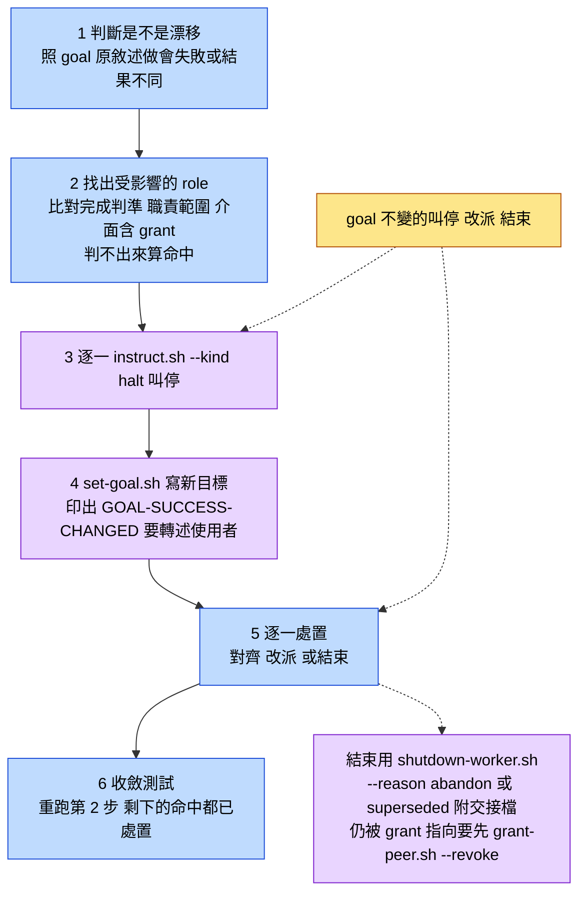
```mermaid
flowchart TD
    s1["1 判斷是不是漂移<br/>照 goal 原敘述做會失敗或結果不同"] --> s2["2 找出受影響的 role<br/>比對完成判準 職責範圍 介面含 grant<br/>判不出來算命中"]
    s2 --> s3["3 逐一 instruct.sh --kind halt 叫停"]
    s3 --> s4["4 set-goal.sh 寫新目標<br/>印出 GOAL-SUCCESS-CHANGED 要轉述使用者"]
    s4 --> s5["5 逐一處置<br/>對齊 改派 或結束"]
    s5 --> s6["6 收斂測試<br/>重跑第 2 步 剩下的命中都已處置"]
    keep["goal 不變的叫停 改派 結束"] -.-> s3
    keep -.-> s5
    end5["結束用 shutdown-worker.sh<br/>--reason abandon 或 superseded 附交接檔<br/>仍被 grant 指向要先 grant-peer.sh --revoke"]
    s5 -.-> end5

    classDef kOrch fill:#bfdbfe,stroke:#1d4ed8,color:#000
    classDef kScript fill:#e9d5ff,stroke:#7e22ce,color:#000
    classDef kHuman fill:#fde68a,stroke:#b45309,color:#000
    class s1,s2,s5,s6 kOrch
    class s3,s4,end5 kScript
    class keep kHuman
```

- 叫停一定要帶 `--kind halt`：一般下行會把 `delivered` 撥回 `running`，被叫停的 worker 閒下來後會被看門狗推「繼續」。`--kind halt` 同時不寫 `.last_delivered_at`，不會替自動推進預算續杯。
- `instruct.sh` 以結束碼 `7` 結束（收件方卡在核准框）時不能放著，要去處理那個框，否則補投等不到。
- 要結束的 worker 若停在 `delivered`，要先撥回 `running` 再關。

## 11. 中斷恢復

這張圖表達先分岔：只是名稱遺失，還是整個 session 重啟。兩者的處置不同，名稱遺失絕不重掛 watchdog。

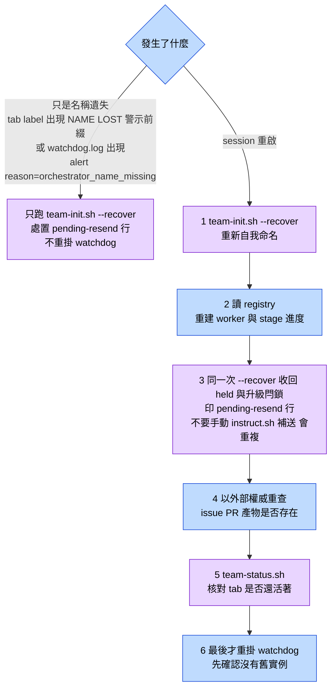
```mermaid
flowchart TD
    q{"發生了什麼"} -->|"只是名稱遺失<br/>tab label 出現 NAME LOST 警示前綴<br/>或 watchdog.log 出現<br/>alert reason=orchestrator_name_missing"| n1["只跑 team-init.sh --recover<br/>處置 pending-resend 行<br/>不重掛 watchdog"]
    q -->|"session 重啟"| r1["1 team-init.sh --recover<br/>重新自我命名"]
    r1 --> r2["2 讀 registry<br/>重建 worker 與 stage 進度"]
    r2 --> r3["3 同一次 --recover 收回 held 與升級閂鎖<br/>印 pending-resend 行<br/>不要手動 instruct.sh 補送 會重複"]
    r3 --> r4["4 以外部權威重查<br/>issue PR 產物是否存在"]
    r4 --> r5["5 team-status.sh<br/>核對 tab 是否還活著"]
    r5 --> r6["6 最後才重掛 watchdog<br/>先確認沒有舊實例"]

    classDef kOrch fill:#bfdbfe,stroke:#1d4ed8,color:#000
    classDef kScript fill:#e9d5ff,stroke:#7e22ce,color:#000
    class q,r2,r4,r6 kOrch
    class n1,r1,r3,r5 kScript
```

名稱遺失的訊號是 tab label 出現 `🚨 ORCHESTRATOR NAME LOST:` 前綴，或 `watchdog.log` 出現 `alert reason=orchestrator_name_missing`。名稱遺失時 `--recover` 會清空升級閂鎖，仍在執行的 watchdog 會在下一輪重發所有仍成立的升級；收到後先對照目前的處置進度，不要重複派調查者。

## 12. registry 結構與速查

registry 根目錄位於 team home 的 `.tmp` 下，路徑為 `.tmp/herdr-agent-team/<workspace_id>`（`.tmp` 是指向 `~/.tmp` 專案資料夾的 symbolic link）。`team-init.sh` 建立根目錄與七個子目錄。

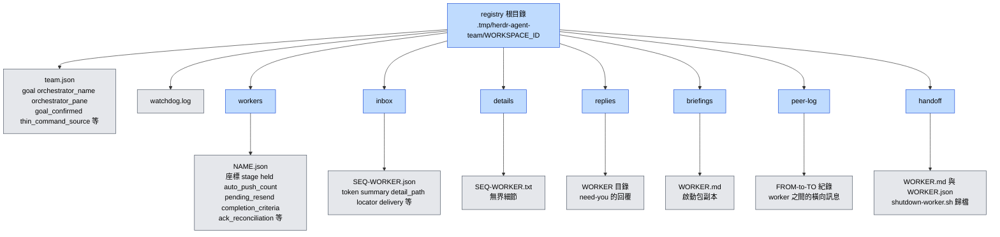
```mermaid
flowchart TB
    root["registry 根目錄<br/>.tmp/herdr-agent-team/WORKSPACE_ID"]
    root --> t["team.json<br/>goal orchestrator_name orchestrator_pane<br/>goal_confirmed thin_command_source 等"]
    root --> wl["watchdog.log"]
    root --> w["workers"]
    root --> i["inbox"]
    root --> d["details"]
    root --> rp["replies"]
    root --> b["briefings"]
    root --> pl["peer-log"]
    root --> h["handoff"]
    w --> w1["NAME.json<br/>座標 stage held auto_push_count<br/>pending_resend completion_criteria<br/>ack_reconciliation 等"]
    i --> i1["SEQ-WORKER.json<br/>token summary detail_path locator delivery 等"]
    d --> d1["SEQ-WORKER.txt<br/>無界細節"]
    rp --> rp1["WORKER 目錄<br/>need-you 的回覆"]
    b --> b1["WORKER.md<br/>啟動包副本"]
    pl --> pl1["FROM-to-TO 紀錄<br/>worker 之間的橫向訊息"]
    h --> h1["WORKER.md 與 WORKER.json<br/>shutdown-worker.sh 歸檔"]

    classDef kDisk fill:#e5e7eb,stroke:#4b5563,color:#000
    classDef kDir fill:#bfdbfe,stroke:#1d4ed8,color:#000
    class root,w,i,d,rp,b,pl,h kDir
    class t,wl,w1,i1,d1,rp1,b1,pl1,h1 kDisk
```

七個子目錄為 `workers`、`inbox`、`details`、`replies`、`briefings`、`peer-log`、`handoff`；`watchdog.log` 與 `team.json` 在根目錄。圖中的 `NAME`、`SEQ`、`WORKER`、`FROM`、`TO` 是佔位詞。

orchestrator 端腳本：

| 腳本 | 用途 |
| --- | --- |
| `team-init.sh` | 自我命名、建立 registry；`--recover` 用於中斷恢復 |
| `set-goal.sh` | 把 goal 四項寫進 `team.json`；`--confirmed` 設定開工閘門 |
| `launch-worker.sh` | 啟動一個 worker 並等到它的 ack、完成對帳 |
| `instruct.sh` | 下行任何指令、定案、goal 傳播；回覆 need-you 用 `--reply-to` |
| `press-approval.sh` | 對卡在核准框的 worker 代按指定的鍵 |
| `shutdown-worker.sh` | 關閉一個 worker，不可逆 |
| `set-worker-field.sh` | 寫 `stage`、`completion_criteria`、`delivery_point`、`end_point` 四個欄位 |
| `grant-peer.sh` | 授權（或 `--revoke` 撤銷）worker 之間的橫向聯繫 |
| `team-status.sh` | 唯讀，逐行列出每個 worker 的狀態概況 |
| `fetch-detail.sh` | 印出某則回報細節檔的路徑，不印內容 |
| `watchdog.sh` | 背景長駐的看門狗；`--once` 供人工巡檢一輪 |

worker 端腳本：

| 腳本 | 用途 |
| --- | --- |
| `report.sh` | worker 唯一的上行入口，六個 token 都經這裡送出 |
| `send-peer.sh` | 已被授權的 worker 橫向直接送訊息給另一個 worker |
| `wait-peer.sh` | worker 端輪詢等同儕的 `state_change_seq` 改變；orchestrator 不使用 |

所有腳本共用的結束碼：

| 碼 | 意義 |
| --- | --- |
| 0 | 成功 |
| 1 | 個別腳本自行產生的部分失敗或迴圈異常 |
| 2 | 呼叫端用錯：缺必填參數、參數格式不對 |
| 3 | 環境前提不成立：`HERDR_ENV` 不等於 `1` |
| 4 | 守衛不通過（workspace 邊界、provider 白名單、開工閘門、關閉閘門、代按前的狀態重查、grant） |
| 5 | registry 缺漏或內容不合法 |
| 6 | herdr 拒絕 |
| 7 | 握手未取得憑據（逾時或 `agent_prompt_stalled`），或代按之後仍是 `blocked` |
| 8 | 啟動未就緒 |
| 9 | 僅 `team-init.sh`：偵測到 `AGENT_TEAM_SELF` 或 `AGENT_TEAM_ROLE`，判定呼叫端是 worker 環境而拒絕執行 |

完整的腳本參考見 `references/script-reference.md`。
